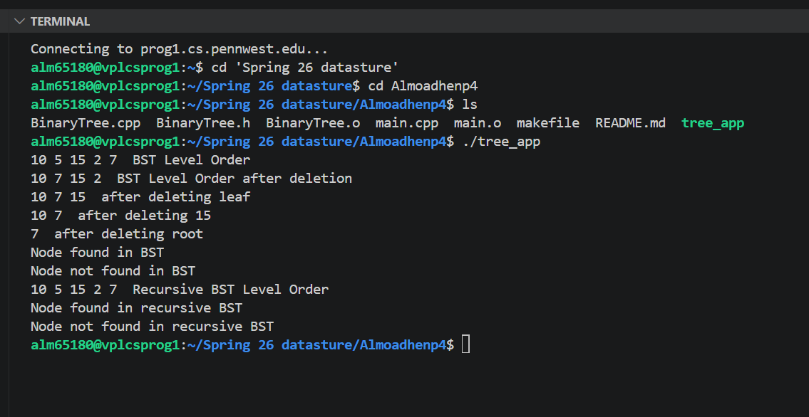

# Binary Search Tree in C++

## Overview

This project implements a Binary Search Tree using C++.

The program demonstrates insertion, deletion, searching, and tree traversal operations using object-oriented programming and smart pointers.

---

## Features

- Iterative node insertion
- Recursive node insertion
- Binary search tree search
- Node deletion
- Preorder traversal
- Inorder traversal
- Postorder traversal
- Level order traversal
- Memory management using `std::unique_ptr`

---

## Technologies Used

- C++
- Object-Oriented Programming
- Smart Pointers
- Binary Search Trees
- Data Structures
- Makefile

---

## Compile

```bash
make
```

---

## Run

```bash
./tree_app
```

---

## Program Output Screenshot



---

## Skills Demonstrated

- Object-Oriented Programming (OOP)
- Data Structures
- Binary Search Trees
- Recursive Programming
- Memory Management
- Smart Pointer Usage
- Tree Traversal Algorithms
- Software Documentation

---

## Learning Outcomes

This project helped strengthen understanding of:

- Binary Search Tree operations
- Recursive and iterative algorithms
- Dynamic memory management
- Tree traversal techniques
- Smart pointers in modern C++
- Makefile project organization
- Object-oriented programming concepts
