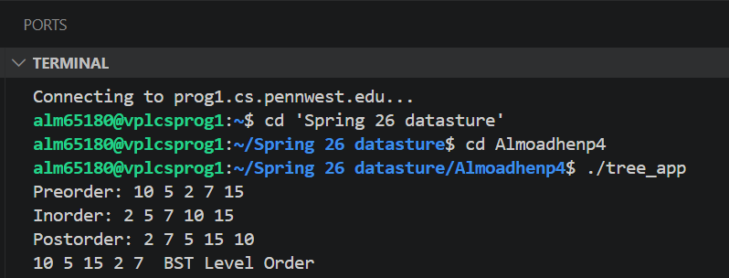

# Binary Search Tree in C++

## Overview

This project implements a Binary Search Tree (BST) in C++ using object-oriented programming principles and modern memory management with `std::unique_ptr`.

The program demonstrates core BST operations including insertion, deletion, searching, and multiple tree traversal algorithms.

---

## Features

- Iterative node insertion
- Recursive node insertion
- Binary Search Tree search operation
- Node deletion
- Preorder traversal
- Inorder traversal
- Postorder traversal
- Level order traversal
- Memory management using `std::unique_ptr`
- Duplicate values are ignored to maintain BST properties

---

## Technologies Used

- C++
- Object-Oriented Programming (OOP)
- Smart Pointers
- Binary Search Trees
- Data Structures
- Makefile

---

## Project Structure

```text
Binary-Tree-BST-Cpp/
│
├── BinaryTree.cpp
├── BinaryTree.h
├── main.cpp
├── Makefile
├── README.md
└── screenshots/
    ├── output.png
    └── traversal_output.png
```

---

## Example Operations

The program demonstrates:

- Creating a Binary Search Tree
- Inserting nodes iteratively
- Inserting nodes recursively
- Searching for existing and missing values
- Deleting a leaf node
- Deleting a node with children
- Deleting the root node
- Printing preorder traversal
- Printing inorder traversal
- Printing postorder traversal
- Printing level order traversal

---

## Compile

```bash
make
```

---

## Run

```bash
./tree_app
```

---

## Sample Output

```text
Inorder Traversal:
20 30 40 50 60 70 80

Searching for 40:
40 found

Searching for 100:
100 not found

Deleting leaf node 20...
Deleting node with children 30...
Deleting root node 50...

Level Order Traversal:
60 40 70 80
```

---

## Program Output Screenshot


---

## Traversal Output Screenshot



---

## Skills Demonstrated

- Object-Oriented Programming (OOP)
- Data Structures
- Binary Search Trees
- Recursive Programming
- Memory Management
- Smart Pointer Usage
- Tree Traversal Algorithms
- Software Documentation

---

## Learning Outcomes

This project helped strengthen understanding of:

- Binary Search Tree operations
- Recursive and iterative algorithms
- Dynamic memory management
- Tree traversal techniques
- Smart pointers in modern C++
- Makefile project organization
- Object-oriented programming concepts

---

## Future Improvements

Possible future improvements include:

- Tree balancing (AVL Tree or Red-Black Tree)
- Visualization of the tree structure
- Unit testing
- Template support for generic data types
- Performance analysis for large datasets
